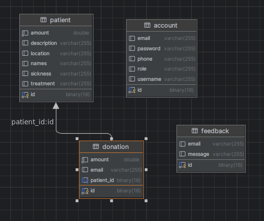
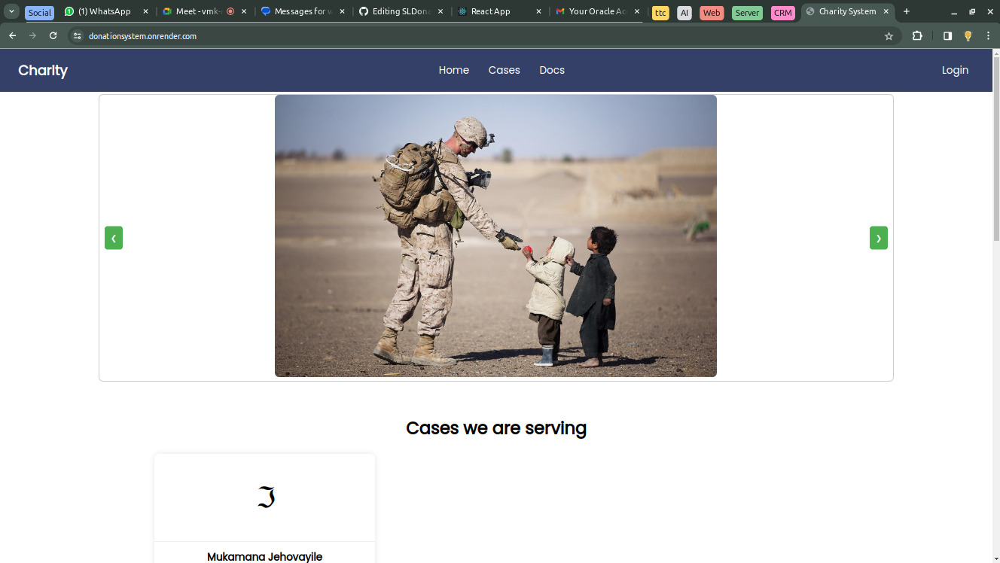
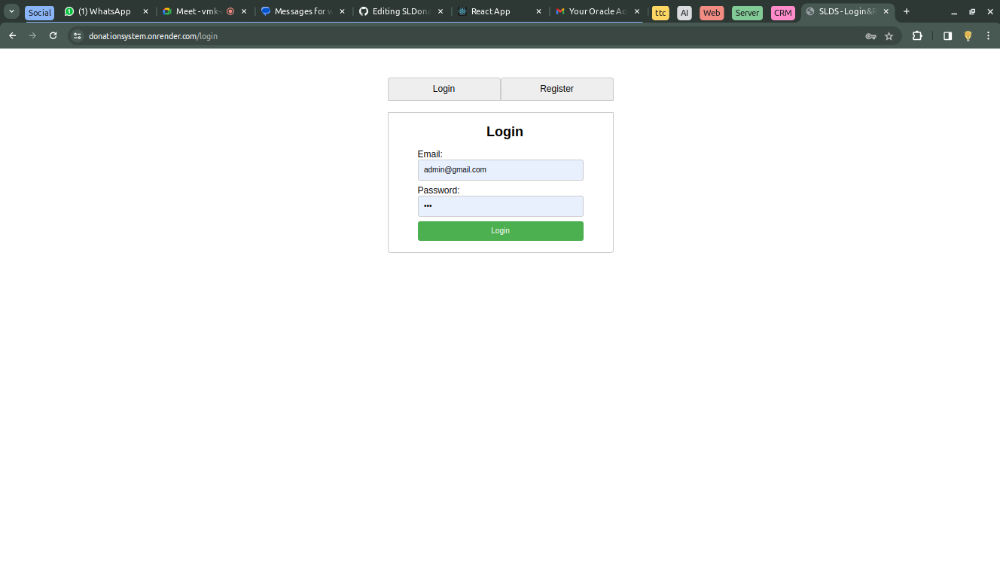
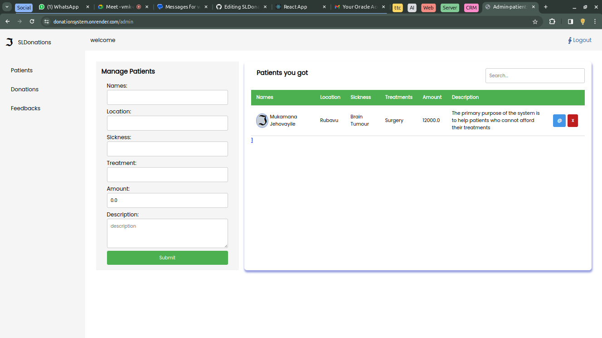
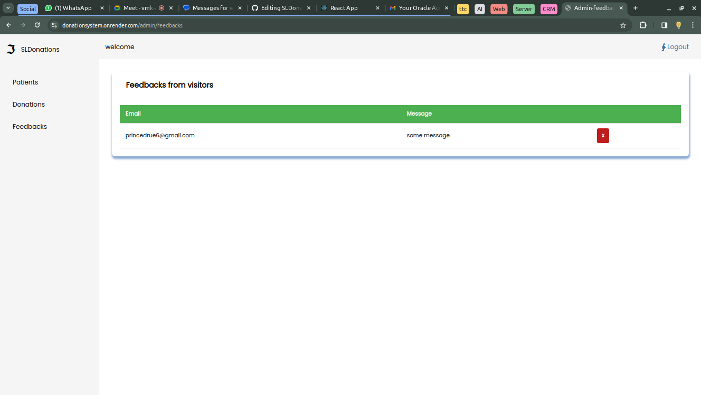

# Charity System Documentation

## Save Life by Donation System

### 1. Introduction

#### 1.1 Overview

The Charity System is a platform designed to facilitate the donation process, manage patients, and organize filter donations to save lives through community support.

#### 1.2 Purpose of the System

The primary purpose of the system is to help patients who cannot afford their treatments.

#### 1.3 Target Audience

- Donors
- Patients
- Administrators

### 2. Getting Started

#### 2.1 System Requirements

To access the system, users need an internet connection and a compatible web browser.

#### 2.2 System's Structure
Here is the erd of the system

#### 2.2 Accessing the System

- Visit [https://donationsystem.onrender.com/](https://donationsystem.onrender.com/)
##### Homepage actions
- Donor will view all we serve
- Donor can choose to donate one of them
- donor add's amount and email for submitting
- Donor can also send a feedback down on page
  
- 

  
- To register or login:- [https://donationsystem.onrender.com/login](https://donationsystem.onrender.com/login)
  
##### Registration rules
- password must be more or equal to 5 characters
- user must use valid email
- user must add phone with 10 characters
- and all fields are required

 
  
- After login, you’ll access the System’s dashboard as an admin.

##### Admin is able to:
- add, view, update and delete patients, 
- view and delete Donations
- view and delete feedbacks
  
- 

#### 2.3 User Roles and Permissions

- **Donors:** Can make donations and send feedback.
- **Administrators:** Have full access to system features, such as:
  - Create account
  - Login
  - CRUD on patients
  - Search & Filter
  - View Donations and delete

### 3. Donations

#### 3.1 Making a Donation

1. Log in to your account.
2. Navigate to the "Donate" section.
3. Choose the donation type and amount.
4. Complete the payment process.

#### 3.2 Donation Process

- User visits [https://donationsystem.onrender.com/](https://donationsystem.onrender.com/) and views all patients to donate.
- User clicks donate button to add a donation by simply entering email and amount.
- After a successful donation, the user will get an email with thanks.

### 4. Feedback

#### 4.1 Sending a Feedback

- User visits [https://donationsystem.onrender.com/](https://donationsystem.onrender.com/) and scrolls to the footer to enter an email and feedback message.
- After a successful feedback, the user will be notified by email.
- 
- Admin can view all feedbacks sent
- 
